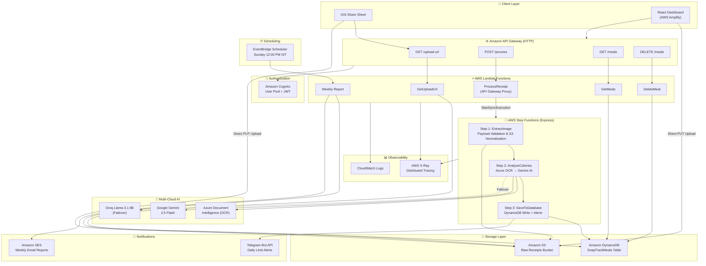

# ⚡ SnapTrack.AI // Serverless Calorie Intelligence

SnapTrack.AI is an enterprise-grade, multi-cloud serverless application that completely automates calorie and macronutrient tracking. 

By utilizing edge-ingestion via iOS Shortcuts, the architecture bypasses traditional API payload limits, routing raw image data directly into AWS for processing by a highly-available, multi-model AI pipeline (Google Gemini + Groq/Llama 3). 

  

---

## 🏗️ System Architecture



---

## 🔁 Request Lifecycle

This project implements a fully decoupled, event-driven backend utilizing the **"Two-Step S3 Dance"** for edge ingestion, paired with a **self-healing LLM fallback system** and an **AWS Step Functions orchestration layer**.

### 1. Edge Ingestion (iOS / React → AWS)
* **The S3 Presigned URL Pipeline:** To avoid API Gateway's 10MB payload limits and Base64 encoding corruption, the client first pings `GET /upload-url` to securely request an ephemeral S3 Presigned URL from `GetUploadUrl` Lambda.
* **Direct Binary Upload:** The client then pushes the raw `.jpg` binary directly into the `snaptrack-raw-receipts` S3 bucket, ensuring zero data corruption and massive scalability.

### 2. Step Functions Orchestration (Express Workflow)
Instead of a monolithic "Fat Lambda", receipt processing is decomposed into **three single-purpose microservices** chained via an **AWS Step Functions Express Workflow**:

| Step | Lambda | Responsibility |
|------|--------|----------------|
| **Step 1** | `step1_extractImage` | Parses the event payload, normalizes S3 bucket/key paths, and performs strict image type validation |
| **Step 2** | `step2_analyzeCalories` | Securely fetches the image buffer directly from S3 using IAM roles, runs **Azure Document Intelligence** OCR, then passes extracted text to **Google Gemini 2.5 Flash** for macro estimation. Includes automatic **retry (2× with 2s backoff)** on transient failures |
| **Step 3** | `step3_saveToDatabase` | Writes structured nutritional JSON to DynamoDB, scans daily totals, and fires a **Telegram push alert** if the user exceeds their calorie target |

The `ProcessReceipt` Lambda acts as a lightweight **API Gateway Proxy**, invoking the Express Step Function synchronously via `StartSyncExecution` and returning the result directly to the React frontend for **instant UI updates** — no page reload required.

### 3. Self-Healing Multi-Model Failover
To ensure absolute reliability against third-party API throttling (e.g., `503 Service Unavailable`), Step 2 implements a dynamic failover protocol:
* If Google Gemini fails, the Step Function's built-in **Retry policy** automatically waits 2 seconds and retries up to 2 times with exponential backoff.
* If all retries are exhausted, the system is designed for graceful degradation via **Groq's Llama 3.1 8B** model as a fallback.

### 4. Data Storage & Event-Driven Alerts
* **DynamoDB:** The resulting nutritional JSON is saved to a serverless Amazon DynamoDB table (`SnapTrackMeals`).
* **Telegram Alerts:** Post-save, Step 3 runs a `Scan` to aggregate the user's daily caloric intake. If the total exceeds the dynamic daily target (e.g., 2200 kcal), it fires an HTTP POST to the **Telegram Bot API**, delivering a real-time push notification.
* **Weekly SES Reports:** An **EventBridge Scheduler** triggers `snaptrack-weekly-report` every Sunday at 12:00 PM IST. This Lambda scans the past 7 days of data, calculates nutritional averages, and sends a cyberpunk-styled HTML email via **Amazon SES**.

### 5. Frontend Analytics (React + Tailwind + Amplify)
* A cyberpunk-themed, dark-mode React dashboard provides real-time nutritional tracking.
* Features a dynamic progress bar for daily caloric targets and an "Active Day" toggle to dynamically adjust baseline metabolic goals.
* **Instant UI updates** — processed meal data is appended directly to local React state without requiring a page refresh.
* Hosted on **AWS Amplify** with automated CI/CD from GitHub.

---

## ☁️ AWS Services Used

| Service | Purpose | Details |
|---------|---------|---------|
| **AWS Lambda** | Serverless compute | 8 functions (Node.js 20.x): `GetUploadUrl`, `ProcessReceipt` (proxy), `GetMeals`, `DeleteMeal`, `step1_extractImage`, `step2_analyzeCalories`, `step3_saveToDatabase`, `snaptrack-weekly-report` |
| **AWS Step Functions** | Workflow orchestration | Express Workflow (`SnapTrack-Processing-Express`) chaining 3 Lambdas with retry policies |
| **Amazon API Gateway** | HTTP API | 4 routes: `GET /upload-url`, `POST /process`, `GET /meals`, `DELETE /meals` with JWT authorization |
| **Amazon S3** | Object storage | `snaptrack-raw-receipts` bucket for raw receipt image binary storage |
| **Amazon DynamoDB** | NoSQL database | `SnapTrackMeals` table for structured nutritional data |
| **Amazon Cognito** | Authentication | User Pool with JWT-based authorization on all API routes |
| **Amazon SES** | Email delivery | Weekly nutritional summary reports (HTML email) |
| **Amazon EventBridge Scheduler** | Cron scheduling | `SnapTrack-Weekly-Sunday-Trigger` — fires every Sunday 12:00 PM IST |
| **AWS Amplify** | Frontend hosting | CI/CD deployment for the React (Vite) dashboard |
| **AWS X-Ray** | Distributed tracing | Active tracing on all Lambdas for latency visualization |
| **AWS CloudWatch** | Logging & monitoring | Centralized log groups for every Lambda function |
| **AWS IAM** | Access management | Strict least-privilege roles with scoped inline policies |

---

## 🤖 Multi-Cloud AI Services

| Provider | Service | Usage |
|----------|---------|-------|
| **Microsoft Azure** | Document Intelligence | Receipt OCR text extraction |
| **Google Cloud** | Gemini 2.5 Flash | Primary LLM for calorie & macro estimation |
| **Meta / Groq** | Llama 3.1 8B | Failover LLM for guaranteed uptime |

---

## 🛠️ Full Technology Stack

**Infrastructure & Cloud:**
* AWS Lambda (Node.js 20.x) × 8 Functions
* AWS Step Functions (Express Workflow)
* Amazon S3 (Binary Storage)
* Amazon API Gateway (HTTP API + JWT Auth)
* Amazon DynamoDB (NoSQL)
* Amazon Cognito (User Pools)
* Amazon SES (Transactional Email)
* Amazon EventBridge Scheduler (Cron)
* AWS Amplify (CI/CD + Static Hosting)
* AWS X-Ray (Distributed Tracing)
* AWS IAM (Least-Privilege Policies)

**Artificial Intelligence:**
* Microsoft Azure Document Intelligence (OCR)
* Google Gemini 2.5 Flash (Primary LLM)
* Meta Llama 3.1 8B via Groq (Failover LLM)

**Frontend:**
* React 19 (Vite)
* Tailwind CSS
* AWS Amplify UI Components

**Notifications & Alerts:**
* Telegram Bot API (Real-time push alerts)
* Amazon SES (Weekly email reports)

---

## 🚀 Key Engineering Challenges Solved

1. **The Base64 Trap:** Successfully engineered around API Gateway's inability to efficiently handle binary image files by utilizing S3 Presigned URLs for direct edge-to-storage ingestion.
2. **Fat Lambda → Step Functions:** Decomposed a monolithic processing Lambda into 3 single-purpose microservices orchestrated by an Express Step Function, enabling independent scaling, retry policies, and distributed tracing per step.
3. **Third-Party API Deprecation/Downtime:** Implemented a robust retry + failover system combining Step Functions native retries (2× with exponential backoff) and a multi-model LLM routing system to guarantee uptime during provider outages.
4. **Synchronous Step Function Proxy:** Used `StartSyncExecution` to bridge the gap between Express Step Functions and API Gateway, enabling the React frontend to receive processed data in a single HTTP round-trip for instant UI updates.
5. **Event-Driven Push Notifications:** Bypassed the need for costly Apple Developer certificates by utilizing Telegram's Bot API as a secure, free webhook delivery system for daily calorie threshold alerts.
6. **Automated Reporting Pipeline:** Built a fully serverless weekly reporting system using EventBridge Scheduler → Lambda → DynamoDB Scan → SES HTML email, requiring zero always-on infrastructure.

---

## 📂 Project Structure

```
snaptrack-ai/
├── aws/
│   ├── lambda/
│   │   ├── processReceipt/         # API Gateway Proxy → Step Functions
│   │   ├── getUploadUrl/           # S3 Presigned URL generator
│   │   ├── getMeals/               # DynamoDB meal retrieval
│   │   ├── deleteMeal/             # DynamoDB meal deletion
│   │   ├── step1_extractImage/     # Step Function: S3 image extraction
│   │   ├── step2_analyzeCalories/  # Step Function: AI calorie analysis
│   │   ├── step3_saveToDatabase/   # Step Function: DynamoDB + Telegram
│   │   └── weeklyReport/           # SES weekly email report
│   └── step-functions/
│       └── receipt-processor.json  # ASL state machine definition
├── frontend/
│   └── src/
│       ├── App.jsx                 # Main dashboard component
│       ├── main.jsx                # Amplify + Cognito config
│       └── index.css               # Cyberpunk theme styles
├── scripts/
│   ├── deploy_frontend.sh          # Amplify manual deployment
│   ├── deploy_processing.sh        # Monolithic Lambda deployment
│   ├── deploy_step_functions.sh    # Step Functions Lambda deployment
│   └── deploy_weekly_report.sh     # Weekly report Lambda deployment
└── README.md
```